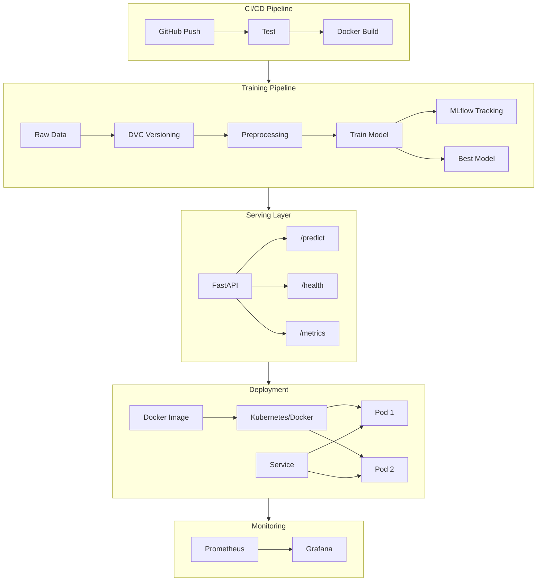

# Image Classifier

This project implements a production-grade MLOps pipeline for binary image classification (Cats vs Dogs). It demonstrates an end-to-end workflow including data versioning, model training with experiment tracking, API deployment, containerization, and comprehensive monitoring.

## 🚀 Project Overview

The goal of this project is to provide a robust, scalable solution for classifying pet images. It leverages modern MLOps tools and best practices to ensure reproducibility, reliability, and observability.

### ✨ Key Features
*   **Data Versioning**: Managed via **DVC** to track dataset changes and ensure reproducibility.
*   **Experiment Tracking**: Integrated with **MLflow** to log metrics, parameters, and model artifacts.
*   **API Serving**: High-performance inference API built with **FastAPI**.
*   **Containerization**: Fully Dockerized application for consistent deployment environments.
*   **Monitoring**: Real-time observability using **Prometheus** (metrics scraping) and **Grafana** (visualization).
*   **CI/CD**: Automated testing and build pipelines using GitHub Actions.

---

## 🏗️ Architecture

The project follows a modular MLOps architecture ensuring separation of concerns between data, training, and deployment.



## 📂 Project Structure

```bash
├── app/                 # FastAPI application code
│   └── main.py          # API endpoints and logic
├── src/                 # Source code for model training
│   ├── train.py         # Training script
│   └── model.py         # Model architecture definition
├── tests/               # Automated tests
├── scripts/             # Utility and setup scripts
├── k8s/                 # Kubernetes deployment manifests
├── deployment/          # Deployment configurations (Monitoring)
│   └── monitoring/      # Grafana dashboard JSON
├── .github/workflows/   # CI/CD pipeline definitions
├── data/                # Dataset (tracked by DVC)
├── models/              # Trained model artifacts
└── prometheus-local.yml # Local Prometheus configuration
```

---

## 🛠️ Setup & Installation

### Prerequisites
*   Python 3.8+
*   Docker & Docker Compose
*   DVC (installed via pip)

### 1. Installation
Clone the repository and install dependencies:
```bash
git clone <repository-url>
cd mlops-assignment-2
pip install -r requirements.txt
```

### 2. Data Setup
Initialize DVC and pull the tracked data:
```bash
dvc init
dvc pull
```

### 3. Model Training
Train the model and log experiments to MLflow:
```bash
# Verify DVC pipeline
dvc repro

# Or run training manually
python src/train.py
```
> **Note**: This will generate `models/cats_dogs_model.npz` and `models/metrics.json`.

---

## 📊 Experiment Tracking (MLflow)
MLflow is used to track all training runs, logging accuracy, loss, and hyperparameters.

To launch the MLflow UI:
```bash
mlflow ui --host 0.0.0.0 --port 5001
```
Access at: `http://localhost:5001`

**Screenshot:**


---

## 🚀 Running the API
The application uses FastAPI for serving predictions.

**Run locally:**
```bash
uvicorn app.main:app --host 0.0.0.0 --port 8000 --reload
```
**Access Swagger UI:** `http://localhost:8000/docs`

### API Endpoints
*   `GET /health`: Health check status.
*   `GET /metrics`: Prometheus metrics endpoint.
*   `POST /predict`: Classify an image (accepts URL or Base64).

**Example Request:**
```json
{
  "image_url": "https://images.unsplash.com/photo-1543466835-00a7907e9de1?ixlib=rb-4.0.3&auto=format&fit=crop&w=500&q=60"
}
```

---

## 🐳 Docker Deployment
Build and run the containerized application:

```bash
# Build image
docker build -t cats-dogs-classifier .

# Run container
docker run -p 8000:8000 cats-dogs-classifier
```

---

## 📈 Monitoring (Prometheus & Grafana)
We use a complete monitoring stack to track application health, request rates, latency, and prediction analytics.

### Launching the Stack
Ensure Docker is running, then launch the containers:

```bash
# Run Prometheus
docker run -d --name prometheus -p 9090:9090 -v "$(pwd)/prometheus-local.yml":/etc/prometheus/prometheus.yml --add-host host.docker.internal:host-gateway prom/prometheus:v2.45.0

# Run Grafana
docker run -d --name grafana -p 3000:3000 grafana/grafana:10.0.0
```

### Dashboards
*   **Prometheus**: `http://localhost:9090` - Verifies metric scraping.
*   **Grafana**: `http://localhost:3000` (Default login: `admin`/`admin`).

**Grafana Dashboard:**
Includes panels for:
*   Request Rate (requests/sec)
*   Prediction Distribution (Pie Chart: Cats vs Dogs)
*   95th Percentile Latency


**Prometheus Targets:**


---

## 🔄 CI/CD Pipeline
The project includes a GitHub Actions pipeline (`.github/workflows/ci.yaml`) that:
1.  **Tests** the capabilities with Pytest (`tests/`).
2.  **Builds** the Docker image upon successful checks.

## Repository

GitHub: [https://github.com/JharwalSapna/End-to-End-Cats-vs-Dogs-Classifier](https://github.com/JharwalSapna/End-to-End-Cats-vs-Dogs-Classifier)

